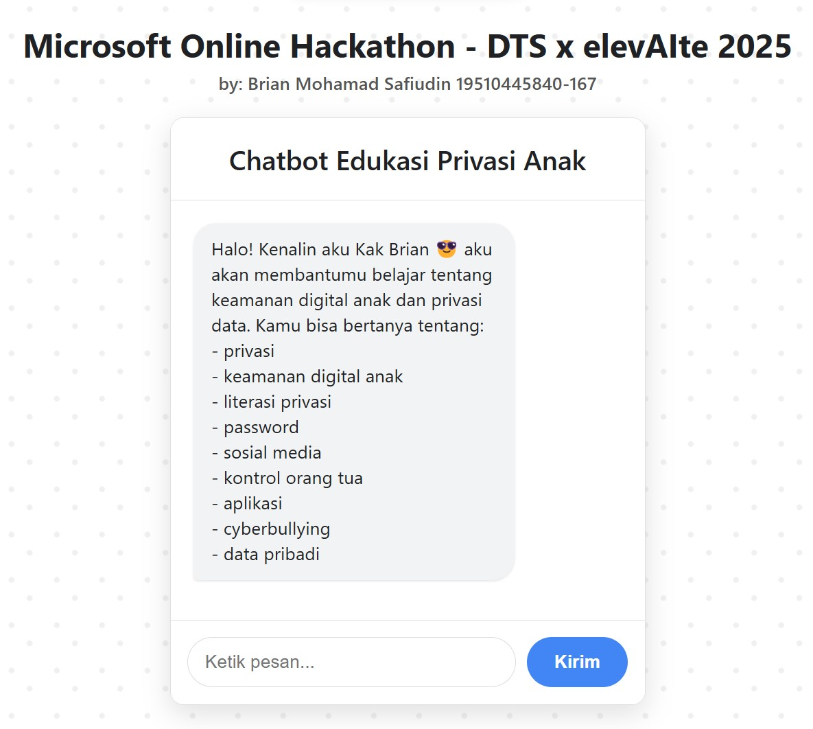

# Chatbot Edukasi Privasi Anak

Aplikasi chatbot interaktif yang membantu anak-anak dan orang tua belajar tentang keamanan digital dan privasi data dengan cara yang mudah dipahami dan menyenangkan. Chatbot ini memberikan jawaban edukatif berdasarkan pertanyaan pengguna, sehingga meningkatkan literasi digital anak dan memfasilitasi komunikasi mengenai topik keamanan online.

## Fitur Utama
- Chatbot berbasis AI yang mampu menjawab pertanyaan seputar keamanan digital anak.
- Deteksi konten tidak aman untuk menjaga percakapan tetap positif dan aman.
- Antarmuka web responsif dan ramah pengguna.
- Backend menggunakan integrasi Azure Text Analytics API dan Flask untuk analisis sentimen.
- Tersedia tanpa login, akses mudah melalui browser.

## Teknologi yang Digunakan
- Python 3.13.
- Flask (Web framework).
- Azure Text Analytics API (Sentiment analysis).
- HTML, CSS, JavaScript (Frontend).

## Cara Penggunaan
1. Buka aplikasi melalui browser pada URL yang disediakan.
2. Ketik pertanyaan terkait privasi dan keamanan digital anak di kolom input.
3. Kirim pesan dan chatbot akan memberikan jawaban edukatif secara real-time.
4. Lanjutkan bertanya untuk informasi lebih lanjut.

## Demo
Link demo aplikasi: https://brianmohamads.pythonanywhere.com
